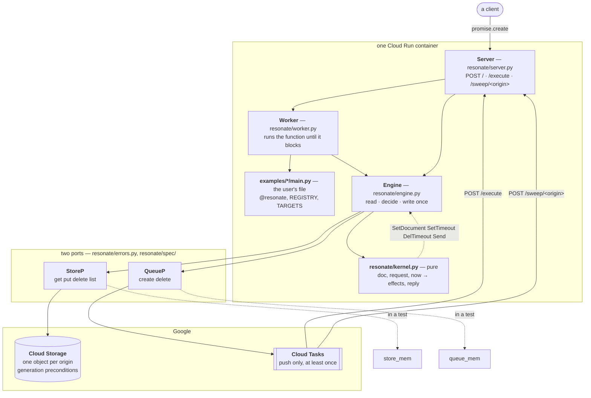

# The shape of it

One picture, and the three claims it makes.

`SEQUENCE.md` says what happens in what order. This says what the parts are
and which of them are allowed to touch the outside. Where it names something,
that is the name in the code.

## Three claims

**The kernel does no I/O.** It is a function from a document, a request and
an instant to a list of effects and a reply. It reads no clock, generates no
id, and calls nothing. That is why the same decision can be replayed, graded
against the specification's catalogue, and explored exhaustively — none of
which is possible for code that has already written to a bucket.

**Everything outside is two ports.** Four operations for a store, two for a
queue, and that is the entire surface the engine is allowed to touch. The
memory implementations are not mocks; they are the same contract, and
`spec.check` runs all four against it. Nothing else in the diagram changes
when you swap them, which is the test of whether the line was drawn in the
right place.

**Cloud Tasks pushes, so a worker is an endpoint.** There is no loop
anywhere in this system waiting for work. The queue delivers by POSTing, and
that single fact is why `resonate/server.py` exists, why `/execute` and `/sweep` are
routes rather than functions, and why the whole thing fits in a container
that may not exist between two steps of the same run.

## The one rule the arrows do not show

Effects happen in an order: **arm the deadline → commit → disarm the old →
send**. Every crash window in between leaves the run recoverable, which is
the difference between durable and merely persistent. `SEQUENCE.md` draws
it; `resonate/spec/engine.py` grades it.

## What a run costs

One document per origin means one conditional write per transition, so a
run's transitions are serialised on a single object. Measured against a real
bucket: about two writes per second, and eight concurrent writers moved it
no faster than one. A run needing more than that is a run whose fan-out
should be its own origin. `resonate/store_gcp.py` carries the numbers.
