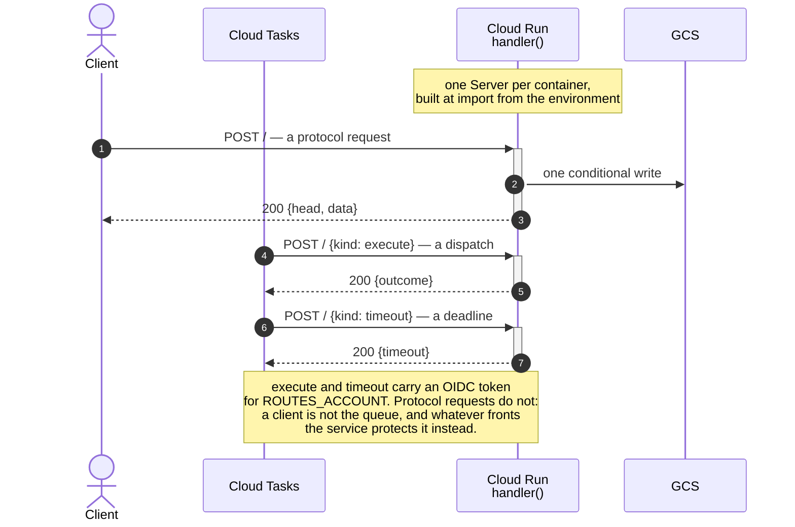
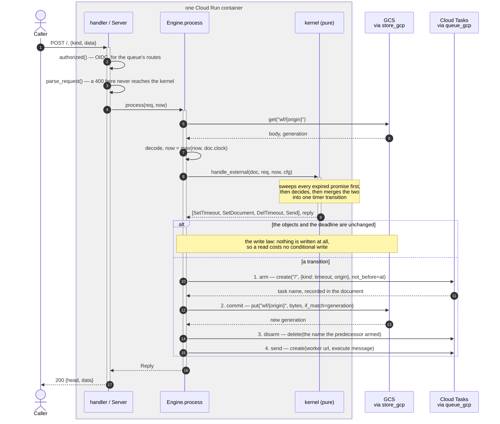
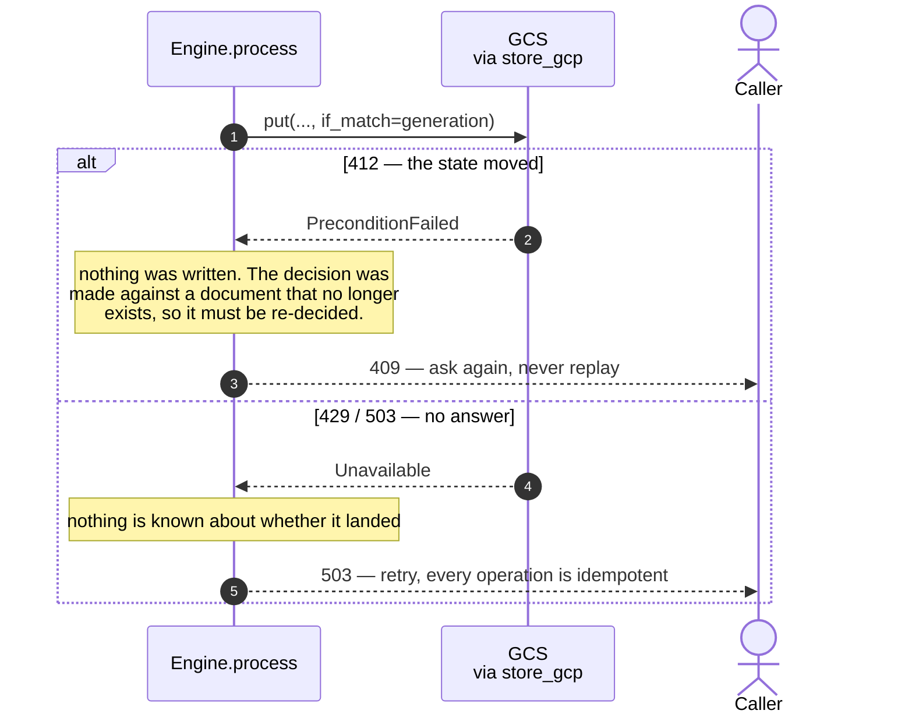
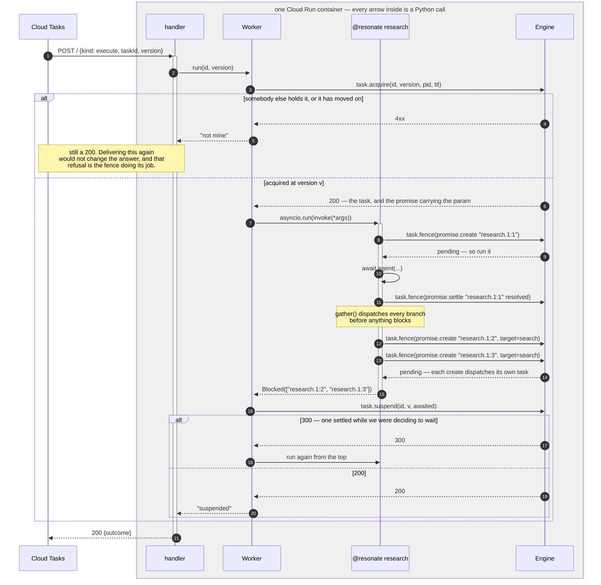
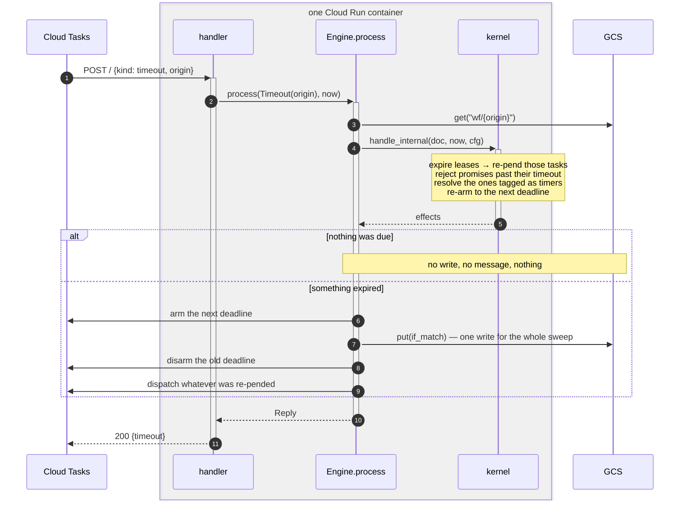
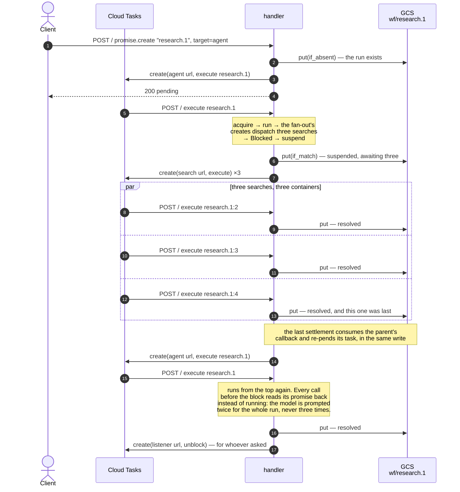

# The Cloud Run function, in sequence

One route, one engine, and one rule about the order effects happen in.
Everything below is what `server.py`, `engine.py` and `worker.py` actually
do; where a diagram says a name, it is the name in the code.

*These are drawn by hand, from what the design says the system does.*

## Who is who

Only two of these lifelines are somewhere else. Everything in a shaded box
is an object inside **one Cloud Run container**, drawn on its own line
because it is worth seeing separately, not because a message to it crosses
anything.

| lifeline | what it actually is |
|---|---|
| **Cloud Tasks** | the queue, and the only thing that sends `execute` and `timeout` messages. A deadline and a dispatch are both tasks in it |
| **GCS** | one object per origin, at `wf/{origin}`. The whole state of a run |
| `handler` / `Server` | `server.py`. The HTTP entry point: `serve()` in `main.py` builds one `Server` per container at import |
| `Worker` | `worker.Worker` — **an object, not a service**. `Server.worker`, built beside the engine in the same container and called in-process. `run` claims the task and decides what the run meant, `_attempt` runs the function from the top |
| `@resonate research` | the user's own function, running under `asyncio.run` inside `Worker._attempt`. Ordinary async Python that mentions no promise, task or lease |
| `Engine.process` | `engine.Engine`, in the same container again. The only thing that does I/O |
| `kernel` | `handle_external` / `handle_internal`. A pure function: a document in, effects out |
| `store_gcp`, `queue_gcp` | the two adapters, in-process clients for the two services that are not |

A worker being an object rather than a process is the part worth pausing
on. Cloud Tasks is push-only, so nothing here polls for work; a delivery
arrives as an HTTP request, the handler hands it to the outer half, and
the worker's whole life is that one call. Two "workers" running at once
are two containers, each with its own `Server`, sharing nothing but the
bucket.

---

## 1. What the function is

Cloud Tasks is push-only, so a worker is not a loop, it is an endpoint.
That single fact decides the shape: every arrow into the function is an
HTTP POST, including the ones the function sent itself.

---

## 2. One request, in full

This is the whole of `Engine.process`, and the numbered effects are the
only interesting part. A committed document whose deadline was never armed
is the one state nothing repairs, so the arm goes first; a message that
outran its commit would be a consequence of an intention rather than of
state, so the send goes last.

### When a step does not answer

The engine never loops on either. A loop here would pick a retry policy —
how many times, how long, whether a re-decided request is the same request
— before anything has said what it should be.

---

## 3. `execute` — a worker running to its block

The outer half of post 002, in the protocol's own words. The function is
run from the top every time; what stops it running twice is not memory but
the promise each call creates at its own position.

Every write the running function makes goes through `task.fence`, at the
version it acquired. A worker that lost its lease cannot write: the fence
refuses, the SDK raises `LeaseLost`, and the attempt hands the task back
rather than settling anything.

The other three ways out of the loop:

| the function | what the worker sends | outcome |
|---|---|---|
| returned | `task.fulfill` resolved | `"done"` |
| raised something of its own | `task.fulfill` **rejected** — a rejection is a result, recorded once and read back on replay | `"rejected"` |
| hit a platform failure (`LeaseLost`, `Conflict`, `Unavailable`) | `task.release` at the same version | `"released"` |

---

## 4. `timeout` — a deadline coming due

The only message no client can send. It is the same `process`, consulting
`handle_internal` instead, and it is idempotent: a duplicate finds nothing
due and the write law stops it writing.

A dropped `execute` is recoverable: the task's retry deadline was
committed before the message left. A dropped `timeout` is not, because the
deadline it carried is the only thing that was going to fire. A deployment
owes this either a generous retry policy or a periodic sweep over the
bucket that depends on no single queued task — `test_queue.py` demonstrates
the hole and the remedy beside it.

---

## 5. A whole run, across four deliveries

Nothing here is a session. Each box is a separate HTTP request to a
container that may never have seen this run before, and everything one of
them knows it read out of one object in the bucket.

The three searches race for the parent's callback and exactly one of them
gets it, because consuming it and settling the promise are the same
conditional write. That is the entire concurrency story.
